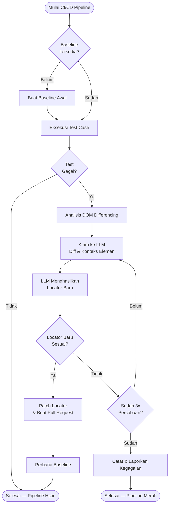

## Rencana Pengembangan Sistem Self-Healing Test Automation

Dokumen ini merinci rencana pengembangan teknis untuk sistem self-healing berbasis LLM yang dijelaskan di `readme.md`.

---

## 1. Pipeline Sistem (Final)

Berikut adalah alur pipeline sistem self-healing yang telah ditetapkan:



### Penjelasan Alur

1. **Baseline Tersedia?** — Sebelum pipeline bisa berjalan normal, harus ada data pembanding (Baseline Store). Jika belum ada, sistem menjalankan proses Buat Baseline Awal terlebih dahulu.
2. **Eksekusi Test Case** — Test case dijalankan seperti biasa di CI/CD pipeline.
3. **Test Gagal?** — Jika semua pass, pipeline selesai hijau tanpa aksi tambahan.
4. **Analisis DOM Differencing** — Jika ada locator yang gagal, sistem mengambil DOM context elemen tersebut dan membandingkannya dengan Baseline Store untuk menemukan apa yang berubah.
5. **Kirim ke LLM** — Hasil diff beserta konteks elemen dikirim ke OpenAI API untuk dianalisis.
6. **LLM Menghasilkan Locator Baru** — LLM memahami perubahan yang terjadi dan menghasilkan candidate locator baru.
7. **Locator Baru Sesuai?** — Locator divalidasi langsung di browser. Jika sesuai, lanjut ke patching. Jika tidak, ulangi ke LLM maksimal 3 kali.
8. **Patch Locator & Buat Pull Request** — File test di-patch otomatis dan Pull Request dibuat ke GitHub untuk direview developer.
9. **Perbarui Baseline** — Setelah PR di-merge, Baseline Store diperbarui agar mencerminkan kondisi UI terbaru.
10. **Catat & Laporkan Kegagalan** — Jika setelah 3 percobaan tetap gagal, kegagalan dicatat dan developer dinotifikasi untuk perbaikan manual.

---

## 2. Gambaran Arsitektur Modul

### 2.1 Baseline Capture System *(Inti — Core Feature)*
- **Baseline Capturer**: menjalankan seluruh test case dalam mode capture, merekam DOM context per elemen saat test berhasil.
- **Baseline Store**: menyimpan DOM context per elemen dalam format JSON (`baseline-snapshots/`), di-commit ke repository.
- **Baseline Updater**: memperbarui Baseline Store setelah Pull Request healing di-merge oleh developer.

### 2.2 Test Runner Layer (Integrasi Playwright)
- Wrapper untuk aksi: `click`, `fill`, `selectOption`, `getByRole`, dll.
- Penangkap error: `TimeoutError`, `ElementNotFoundException`.
- Trigger DOM context capture saat locator gagal.

### 2.3 Self-Healing Core
- **DOM Differencer**: membandingkan DOM context elemen yang gagal dengan entri di Baseline Store, menghasilkan diff yang informatif.
- **Prompt Builder**: menyusun prompt ke LLM yang menyertakan diff, locator lama, dan konteks elemen.
- **LLM Client**: modul pemanggilan OpenAI API (asinkron, dengan retry policy).
- **Locator Validator**: memvalidasi candidate locator langsung di browser runtime.
- **Healing Orchestrator**: mengatur alur dari failure → diff → LLM → validasi → hasil, dengan batas maksimal 3 percobaan.

### 2.4 File Patching & GitHub Automation
- **Test File Patcher**: menemukan dan mengganti locator lama di file `.spec.ts` menggunakan regex yang aman.
- **Git Service**: membuat branch, commit, dan push ke remote.
- **GitHub PR Service**: membuat Pull Request via GitHub API untuk review developer.

### 2.5 Rule-Based Self-Healing *(Sistem Pembanding)*
- Implementasi self-healing sederhana tanpa LLM sebagai baseline penelitian.
- Strategi: coba locator alternatif secara berurutan (ID → name → aria-label → CSS class → text).
- Digunakan untuk mengukur perbedaan efektivitas antara pendekatan konvensional dan LLM-based.

### 2.6 Observability & Metrics
- Logging terstruktur (JSON) untuk setiap event healing.
- Pengukuran metrik: success rate, waktu rata-rata, jumlah retry.
- Report ringkasan yang dapat dibaca Jenkins.

---

## 3. Phase 0 — Baseline Capture System *(Fondasi Utama)*

**Tujuan**: Menyediakan data pembanding yang akurat agar DOM Differencing dapat bekerja.

### 3.1 Mekanisme Baseline Capture

- Perintah khusus: `npm run baseline:capture`
- Menjalankan seluruh test case dalam mode non-healing (capture only).
- Setiap kali locator berhasil menemukan elemen, sistem menyimpan:
  - DOM context: elemen target + parent 2 level + sibling langsung (bukan seluruh halaman).
  - Metadata: nama test, nama step, URL halaman, timestamp.
- Hasil disimpan ke `baseline-snapshots/[test-name]/[step-name].json`.

### 3.2 Format Baseline Store

```json
{
  "locator": "#btn-login",
  "testName": "login_success",
  "stepName": "click submit button",
  "pageUrl": "https://app.omnix.com/login",
  "domContext": "<div class='form-actions'><button id='btn-login'>Login</button></div>",
  "capturedAt": "2026-03-03T10:00:00Z"
}
```

### 3.3 Strategi Penyimpanan

- Disimpan sebagai file JSON di folder `baseline-snapshots/` yang di-commit ke repository.
- Tidak menggunakan PR untuk baseline awal — langsung commit ke branch utama sebagai bagian dari setup.
- Baseline hanya diperbarui ketika PR healing di-merge oleh developer (bukan setiap test pass).

---

## 4. Phase 1 — Failover & Interception (Playwright Wrapper)

**Tujuan**: Semua aksi locator Playwright lewat satu pintu agar setiap failure dapat diintersepsi.

### 4.1 Deliverables Teknis

- Wrapper functions:
  - `safeClick(locatorDescriptor)`
  - `safeFill(locatorDescriptor, value)`
  - `safeSelectOption(locatorDescriptor, value)`
  - `safeGetText(locatorDescriptor)`
- `locatorDescriptor` berisi:
  - String locator asli (CSS/selector Playwright).
  - Informasi test: nama test, file, nama step.
- Di dalam wrapper:
  - Jalankan aksi Playwright normal.
  - `try/catch` untuk `TimeoutError` dan error sejenis.
  - Jika sukses → lanjut tanpa healing.
  - Jika gagal → trigger Self-Healing Core dengan konteks lengkap.

---

## 5. Phase 2 — DOM Differencing *(Core Innovation)*

**Tujuan**: Memberikan konteks perubahan yang presisi kepada LLM, bukan hanya DOM mentah.

### 5.1 DOM Context Capture

- Saat locator gagal, sistem mengambil DOM context elemen yang gagal:
  - Bukan seluruh halaman — hanya elemen target + parent 2 level + sibling langsung.
  - DOM di-clean dari tag yang tidak relevan (`script`, `style`, `svg`, `noscript`, `iframe`).

### 5.2 DOM Differencer

- Membandingkan DOM context saat gagal dengan entri di Baseline Store untuk elemen yang sama.
- Menghasilkan diff yang menunjukkan **apa yang berubah**:

```diff
- <button id="submit">Login</button>
+ <button id="btn-login" class="primary">Sign In</button>
```

- Diff inilah yang dikirim ke LLM — bukan seluruh DOM — sehingga LLM memahami konteks perubahan secara presisi.

### 5.3 Nilai Akademis DOM Differencing

Pendekatan ini unggul dibanding pengiriman DOM mentah karena:
- LLM mendapat informasi **apa yang berubah**, bukan hanya **apa yang ada sekarang**.
- Mengurangi ambiguitas untuk UI kompleks dengan banyak elemen serupa.
- Mengurangi token usage secara signifikan.

---

## 6. Phase 3 — LLM Prompting

**Tujuan**: Menyiapkan prompt yang informatif dan mendapatkan output locator yang presisi dari LLM.

### 6.1 Prompt Builder

- Input yang disertakan dalam prompt:
  - Locator lama yang gagal.
  - Hasil DOM diff (bukan full DOM).
  - Konteks test: nama step, URL halaman.
  - Instruksi output: hanya JSON `{"new_locator": "..."}`.
  - Prioritas locator: `data-testid` → `aria-label` → `role + text` → CSS atribut semantik (hindari XPath dan positional selector).

### 6.2 LLM Client

- Abstraksi di atas OpenAI SDK:
  - Model: `gpt-4o` atau `gpt-3.5-turbo` (konfigurabel via `.env`).
  - Penanganan timeout dan retry untuk error jaringan.
  - Parsing respons: sanitasi output jika LLM menyertakan teks non-JSON.

---

## 7. Phase 4 — Validation & Healing Logic

**Tujuan**: Memastikan locator baru benar-benar valid sebelum di-patch ke file.

### 7.1 Locator Validator

- Di runtime (pada `page` yang sama), jalankan aksi dengan locator baru.
- Locator dinyatakan **sesuai** jika:
  - Elemen ditemukan di DOM (count > 0).
  - Aksi (click/fill/dll) berhasil dijalankan tanpa error.
- Jika tidak sesuai → kembalikan ke LLM untuk percobaan berikutnya.

### 7.2 Healing Orchestrator

- Mengontrol loop healing:
  1. Terima sinyal gagal dari wrapper.
  2. Jalankan DOM Differencing.
  3. Loop maksimal 3 kali:
     - Kirim diff ke LLM.
     - Validasi locator baru di browser.
     - Jika valid → tandai `healed`, simpan hasil.
  4. Jika 3 kali tetap gagal → tandai `failed`, logging lengkap, notifikasi developer.

---

## 8. Phase 5 — Auto-Patching & GitHub Pull Request

**Tujuan**: Mengotomatisasi perubahan locator di file `.spec.ts` dan membuka PR ke GitHub.

### 8.1 Test File Patcher

- Membaca file `.spec.ts` terkait.
- Menemukan dan mengganti `oldLocator` dengan `newLocator` menggunakan regex yang ketat.
- Menjaga struktur dan gaya kode (indentasi, tanda kutip, dll).

### 8.2 Git Service

- Menggunakan `simple-git`:
  - Branch baru: format `auto-healing/[test-name]`.
  - Commit dengan pesan: `chore(self-healing): update locator for [test-name]`.
  - Push ke remote origin.

### 8.3 GitHub PR Service

- Menggunakan GitHub REST API (via `axios`):
  - Title: `[Auto-Healing] Fix locator: [test-name]`.
  - Body: ringkasan perubahan (locator lama → baru, jumlah test yang di-heal).
  - PR siap direview developer sebelum di-merge.

### 8.4 Update Baseline Setelah Merge

- Setelah developer merge PR, jalankan: `npm run baseline:update`.
- Sistem memperbarui entri Baseline Store yang relevan dengan DOM context terbaru.
- Baseline hanya diperbarui setelah validasi developer, bukan otomatis.

---

## 9. Phase 6 — Rule-Based Self-Healing *(Sistem Pembanding)*

**Tujuan**: Menyediakan baseline pembanding untuk mengukur keunggulan LLM-based healing dalam penelitian.

### 9.1 Strategi Rule-Based

Ketika locator gagal, sistem mencoba alternatif secara berurutan:
1. CSS by ID (`#element-id`)
2. `name` attribute (`[name="..."]`)
3. `aria-label` (`[aria-label="..."]`)
4. CSS class (`.class-name`)
5. Visible text (`text="..."`)

### 9.2 Keterbatasan Rule-Based

- Hanya efektif jika elemen masih ada dengan atribut yang berbeda.
- Tidak mampu menangani perubahan struktural DOM.
- Tidak memahami konteks semantik elemen.

### 9.3 Nilai Perbandingan dalam Penelitian

Metrik yang dibandingkan antara Rule-Based vs LLM-Based:
- **Success Rate**: % locator yang berhasil di-heal.
- **Waktu Healing**: latensi rata-rata per kasus.
- **Akurasi**: apakah locator yang dihasilkan menunjuk elemen yang tepat.
- **Cakupan**: jenis perubahan DOM apa yang bisa ditangani.

---

## 10. Phase 7 — Observability & Integrasi Jenkins

**Tujuan**: Memastikan sistem bisa dipantau dan diukur dampaknya di pipeline CI/CD.

### 10.1 Logging

- Log terstruktur (JSON) per event healing:
  - `testName`, `filePath`, `stepName`, `pageUrl`.
  - `oldLocator`, `newLocator`, `domDiff`.
  - `status` (`healed` / `failed` / `skipped`).
  - Jumlah retry, waktu healing.

### 10.2 Metrics Collector

- Setelah test run selesai:
  - Jumlah locator yang berhasil di-heal vs gagal.
  - Waktu rata-rata proses healing.
  - Perbandingan success rate: Rule-Based vs LLM-Based.
- Output: file `healing-results.json` + summary di console.

### 10.3 Integrasi Jenkins

- Step tambahan di pipeline:
  - Jalankan test dengan self-healing aktif.
  - Arsipkan `healing-results.json` sebagai artifact.
  - Publish summary ke dashboard Jenkins.

---

## 11. Milestone Implementasi

### Milestone 1 — Infrastruktur Dasar ✅
- Setup project Node.js/TypeScript + Playwright.
- Modul wrapper: `safeClick`, `safeFill`, `safeSelectOption`, dll.
- Logging dasar saat terjadi error locator.

### Milestone 2 — LLM Integration ✅
- `DOM Cleaner`, `Prompt Builder`, `LLM Client`.
- Uji manual: locator sengaja salah → LLM mengusulkan pengganti.

### Milestone 3 — Validation & Orchestration ✅
- `Locator Validator`, `Healing Orchestrator`, `Results Store`.
- Uji end-to-end: locator gagal → LLM → validasi runtime → healed.

### Milestone 4 — Auto-Patching & GitHub PR ✅
- `Test File Patcher`, `Git Service`, `GitHub PR Service`.
- Uji dengan repo sandbox: patch otomatis + PR terbuka di GitHub.

### Milestone 5 — Baseline Capture & DOM Differencing *(Next)*
- `Baseline Capturer`: perintah `baseline:capture` yang merekam DOM context per elemen.
- `Baseline Store`: format JSON, di-commit ke repository.
- `DOM Differencer`: membandingkan DOM gagal dengan baseline, menghasilkan diff.
- Integrasi diff ke Prompt Builder (gantikan pengiriman full DOM).
- `Baseline Updater`: perintah `baseline:update` setelah PR merge.

### Milestone 6 — Rule-Based Self-Healing *(Pembanding)*
- Implementasi sistem self-healing berbasis heuristik (tanpa LLM).
- Integrasi ke framework yang sama (Playwright).
- Setup eksperimen komparatif: Rule-Based vs LLM-Based.

### Milestone 7 — Test Case OmniX & Eksperimen
- Tulis test case untuk aplikasi OmniX (target: ~10 skenario representatif).
- Jalankan eksperimen dengan skenario perubahan UI yang terkontrol.
- Kumpulkan data metrik untuk bab evaluasi TA.

### Milestone 8 — Observability & Jenkins Integration
- Logging dan metrics lengkap.
- Integrasi penuh dengan Jenkins pipeline.
- Report artifact dan dashboard.

---

## 12. Pertimbangan Khusus

- **Keamanan Regex Patching**: Pastikan regex hanya menyentuh locator yang dimaksud, tidak merusak struktur kode lain.
- **Cost & Latency LLM**: Kirim diff (bukan full DOM) untuk menekan token usage. Pertimbangkan caching untuk pola failure yang berulang.
- **Keamanan Baseline**: Baseline Store di-commit ke repository — pastikan tidak mengandung data sensitif dari DOM aplikasi.
- **Transparansi melalui PR**: Semua perubahan locator difinalisasi melalui Pull Request. Developer tetap memiliki kontrol penuh untuk menerima atau menolak perubahan.
- **Cold Start**: Baseline awal harus dijalankan sebelum pipeline pertama. Dokumentasikan ini sebagai bagian dari setup guide.
